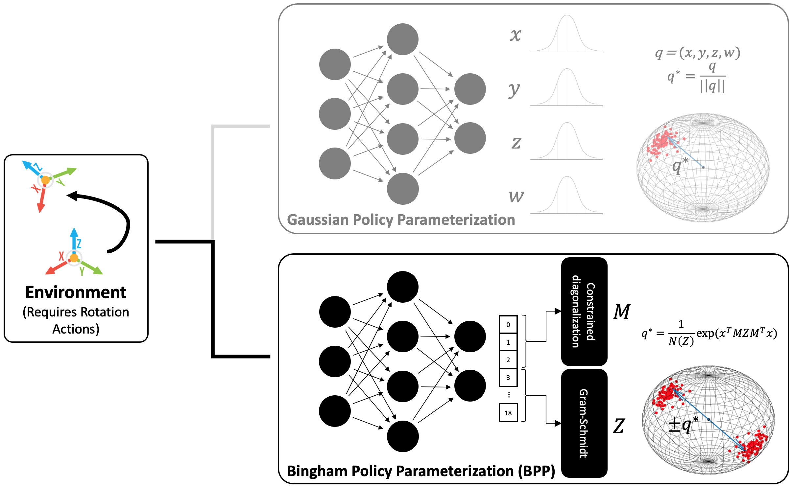

# Bingham Policy Parameterization for 3D Rotations in Reinforcement Learning



Ensure you have pytorch installed on your system. You can install other required packages through:

```
pip install -r requirements.txt
```

Training launched via:

```
python launch.py sac_bpp
```
